# inu IA (Information Architecture) 다이어그램

> 서비스 전체 구조를 시각적으로 표현한 문서

---

## 1. 전체 앱 구조 (App Structure)

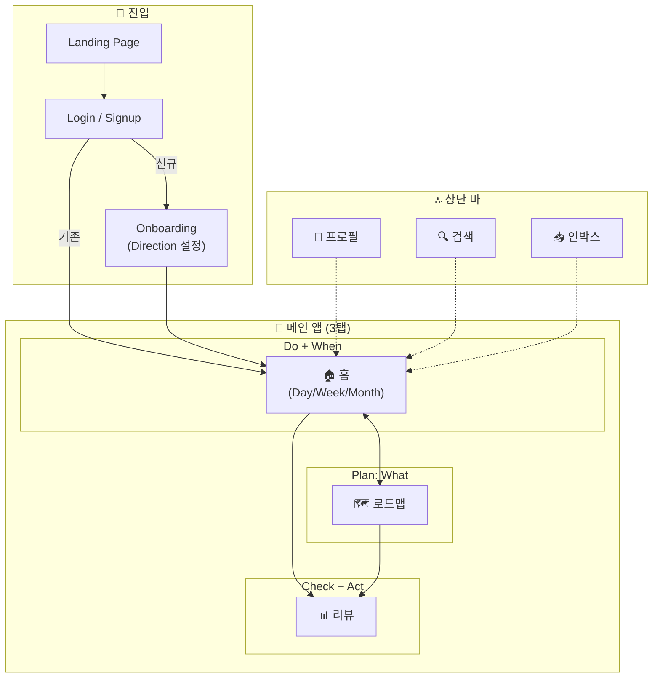

---

## 2. 페이지 네비게이션 흐름

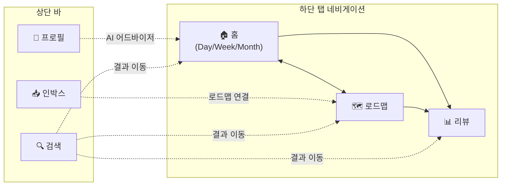

---

## 3. 데이터 계층 구조 (Life Roadmap)

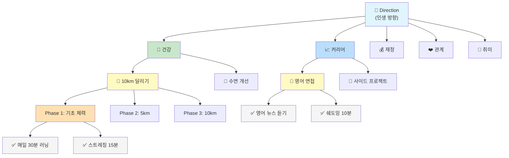

---

## 4. Why Chain

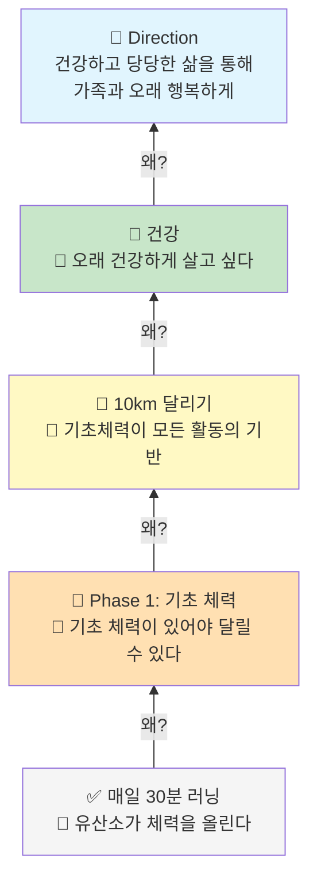

---

## 5. Home Day 뷰 기능 구조

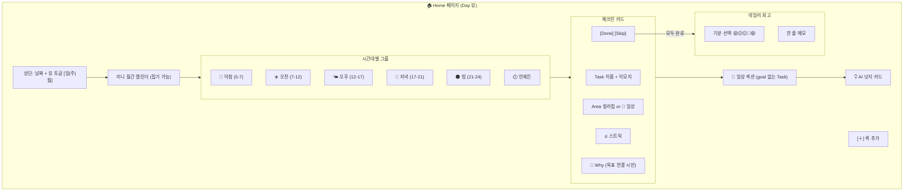

---

## 6. Roadmap 페이지 기능 구조

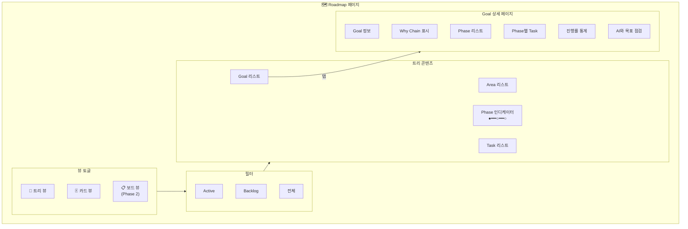

---

## 7. Home 페이지 뷰 모드 구조

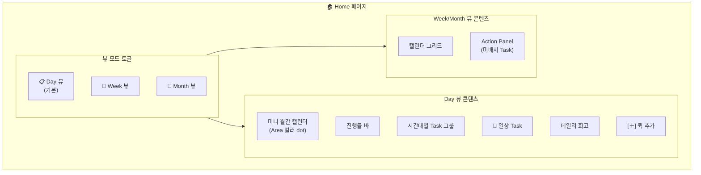

---

## 8. Review 페이지 기능 구조

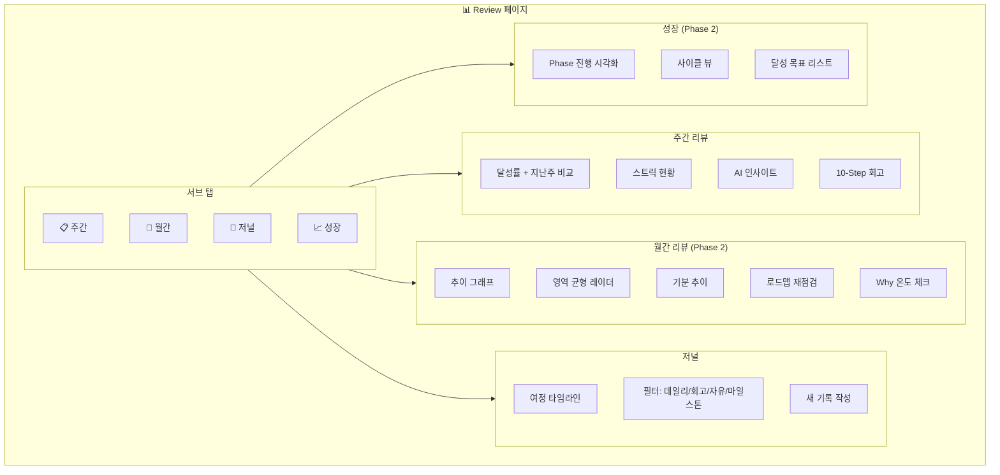

---

## 9. 기능 ↔ 페이지 매핑

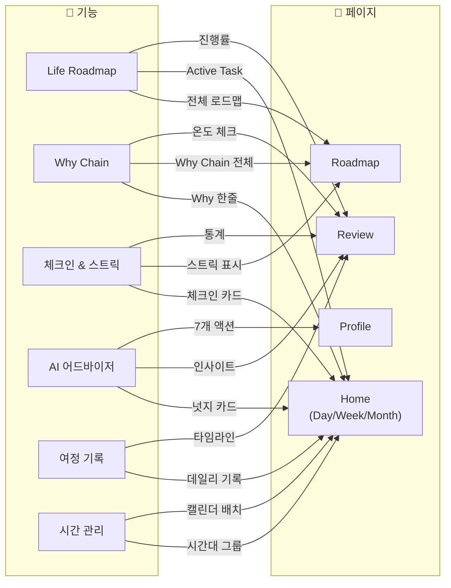

---

## 10. PDCA 순환 구조

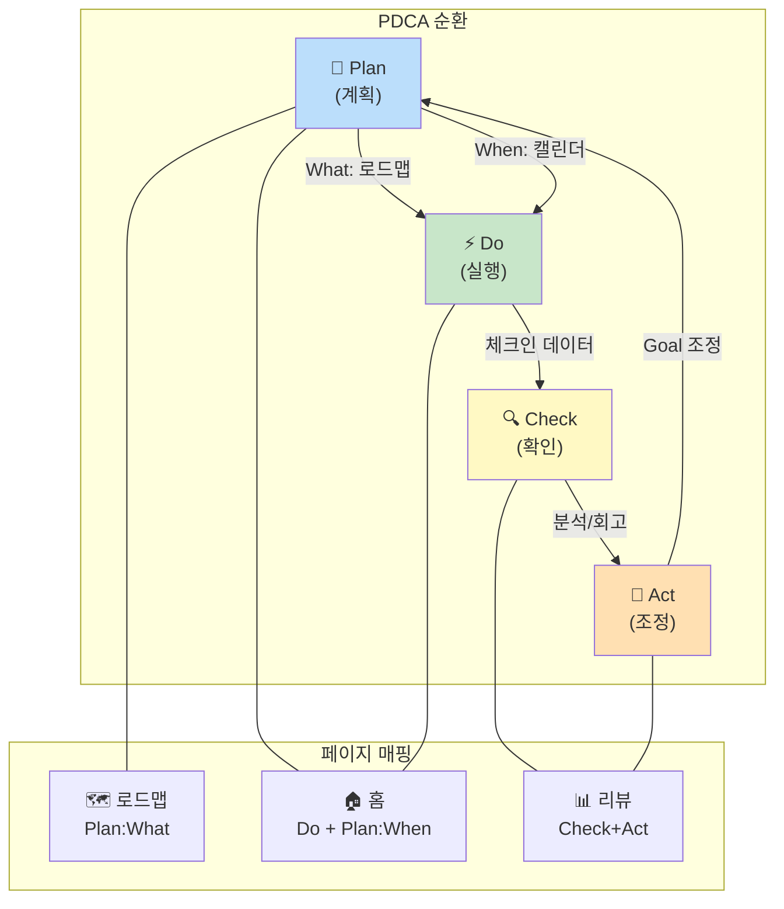

---

## 11. 사용자 여정 (User Journey)

```mermaid
flowchart LR
    subgraph Onboard["온보딩"]
        A1["가입"]
        A2["가치 칩 선택"]
        A3["Direction 설정"]
    end

    subgraph Setup["로드맵 구축"]
        B1["Area 추가"]
        B2["Goal 설정"]
        B3["Phase 나누기"]
        B4["Task 추가"]
    end

    subgraph Daily["매일 루프"]
        C1["앱 열기"]
        C2["Task 체크인"]
        C3["기분 선택"]
        C4["AI 한마디"]
    end

    subgraph Weekly["주간 루프"]
        D1["주간 달성률 확인"]
        D2["AI 인사이트"]
        D3["주간 회고"]
    end

    subgraph Monthly["월간 루프"]
        E1["영역 균형 체크"]
        E2["Goal 재점검"]
        E3["Direction 확인"]
    end

    A1 --> A2 --> A3
    A3 --> B1 --> B2 --> B3 --> B4
    B4 --> C1 --> C2 --> C3 --> C4
    C4 -->|매일 반복| C1
    C4 -->|일요일| D1 --> D2 --> D3
    D3 -->|월말| E1 --> E2 --> E3
    E3 -->|다음 달| C1
```

---

## 12. Goal 상태 전이

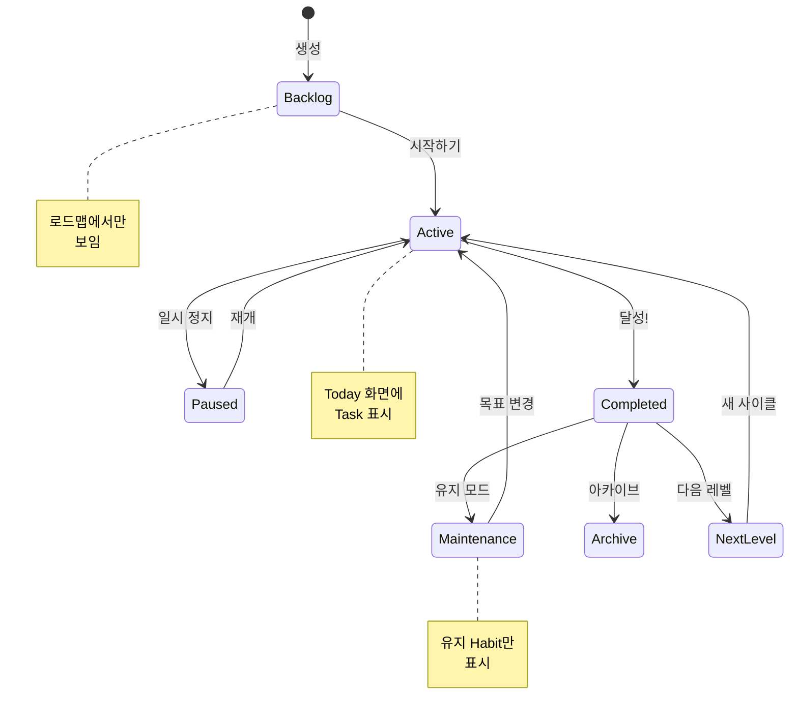

---

## 13. 체크인 상태 전이

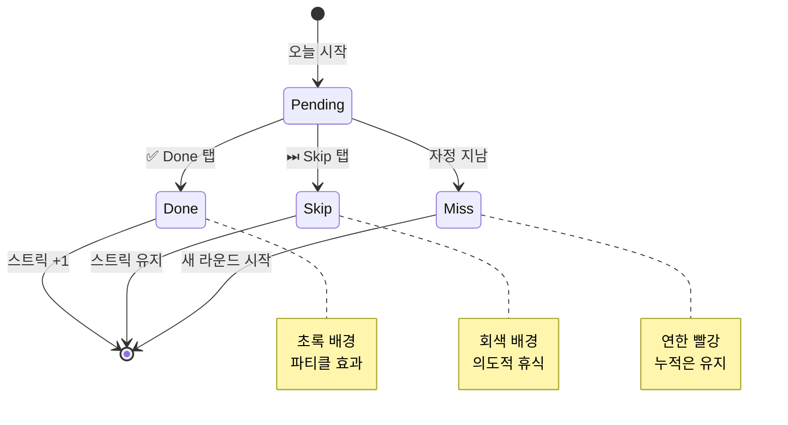

---

## 14. AI 어드바이저 기능 구조

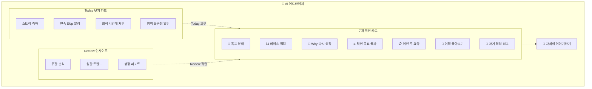

---

## 사용 방법

### VS Code에서 보기

1. "Markdown Preview Mermaid Support" 확장 설치
2. 이 파일을 열고 미리보기 (Ctrl+Shift+V)

### GitHub에서 보기

- GitHub는 Mermaid를 자동으로 렌더링합니다

### 온라인 에디터

- [Mermaid Live Editor](https://mermaid.live/)에서 각 코드 블록을 붙여넣기

### Excalidraw로 변환

1. [Mermaid to Excalidraw](https://mermaid-to-excalidraw.vercel.app/)
2. 각 다이어그램 코드를 붙여넣어 변환

---

> **관련 문서**
>
> - [페이지 간 연관성](page-matrix.md)
> - [기능 ↔ 페이지 매핑](feature-page-mapping.md)
